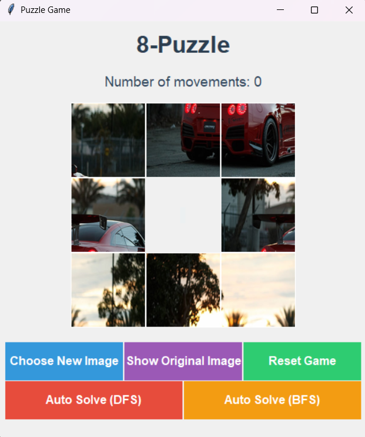

# 🧩 Puzzle Game

A puzzle game built using **Python** and **Tkinter**!  
Select an image, split it into 8 pieces, and rearrange them correctly to solve the puzzle.

---

## ✨ Features

- Upload a new image and split it into tiles.
- Show the original (unsplit) image.
- Reset the game to start over.
- Auto-solve the puzzle using **BFS** (Breadth-First Search) or **DFS** (Depth-First Search) algorithms.

---

## 📸 Screenshot



---

## 🛠 How to Run

1. **Clone the repository:**

   ```bash
   git clone https://github.com/ahmedgomaa2004/PuzzleGame.git
